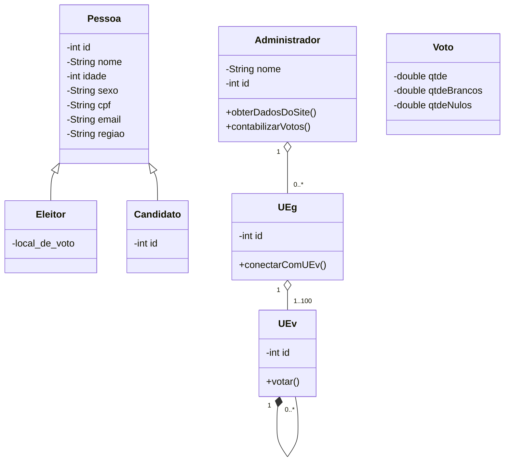

# Diagrama De Classes

```mermaid
classDiagram
Pessoa <|-- Eleitor
Pessoa <|-- Candidato
Pessoa: -int id
Pessoa: -String nome
Pessoa: -int idade
Pessoa: -String sexo
Pessoa: -String cpf
Pessoa: -String email
Pessoa: -String regiao

Eleitor: -local_de_voto

class Candidato{
  -int id
}

class UEg{
  -int id
  +conectarComUEv()
}

class UEv{
  -int id
  +votar()
}

class Administrador{
  -String nome
  -int id
 +obterDadosDoSite()
 +contabilizarVotos()

}

class Voto{
  -double qtde
  -double qtdeBrancos
  -double qtdeNulos
}

Administrador "1" o-- "0..*" UEg
UEg "1" o-- "1..100" UEv
UEv "1" *-- "0..*" UEv

```
