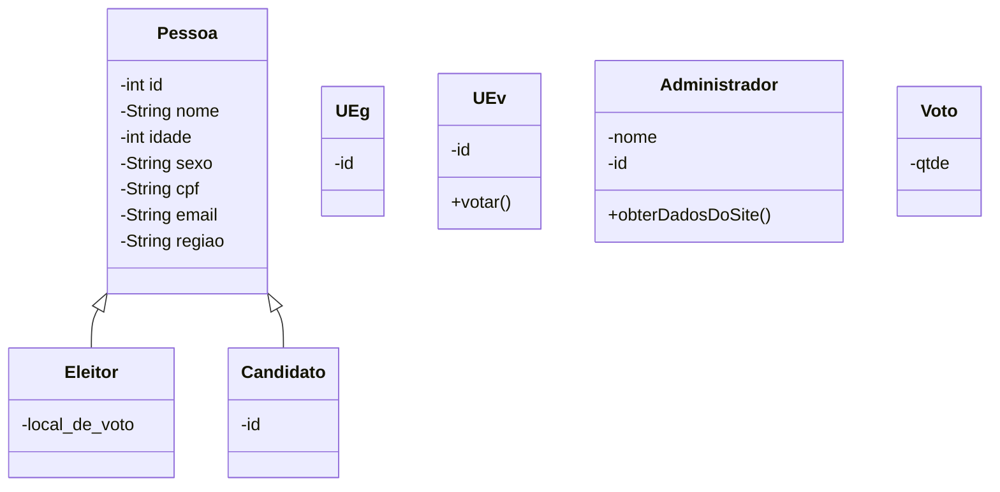

# Diagrama De Classes

```mermaid
classDiagram
Pessoa <|-- Eleitor
Pessoa <|-- Candidato
Pessoa: -int id
Pessoa: -String nome
Pessoa: -int idade
Pessoa: -String sexo
Pessoa: -String cpf
Pessoa: -String email
Pessoa: -String regiao

class Eleitor{
  -local_de_voto
}

class Candidato{
  -id
}

class UEg{
  -id
}

class UEv{
  -id
  +votar()
}

class Administrador{
  -nome
  -id
 +obterDadosDoSite()

}

class Voto{
  -qtde
}


```
