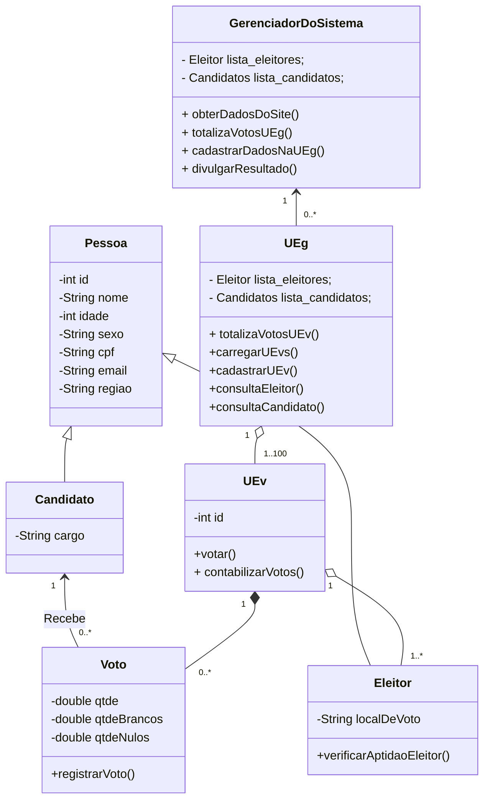

# Diagrama De Classes

```mermaid
classDiagram
Pessoa <|-- Eleitor
Pessoa <|-- Candidato
Pessoa: -int id
Pessoa: -String nome
Pessoa: -int idade
Pessoa: -String sexo
Pessoa: -String cpf
Pessoa: -String email
Pessoa: -String regiao


class Eleitor{
  -String localDeVoto
  +verificarAptidaoEleitor()
}

class Candidato{
  -String cargo
}

class UEg{
    - Eleitor lista_eleitores;
    - Candidatos lista_candidatos;
    + totalizaVotosUEv()
    +carregarUEvs()
    +cadastrarUEv()
    +consultaEleitor()
    +consultaCandidato()
}

class UEv{
  -int id
  +votar()
  + contabilizarVotos()
}

class GerenciadorDoSistema{
    - Eleitor lista_eleitores;
    - Candidatos lista_candidatos;
    + obterDadosDoSite()
    + totalizaVotosUEg()
    + cadastrarDadosNaUEg()
    + divulgarResultado()
}

class Voto{
  -double qtde
  -double qtdeBrancos
  -double qtdeNulos
  +registrarVoto()
}

GerenciadorDoSistema "1" <-- "0..*" UEg
Candidato "1" <-- "0..*" Voto : Recebe
UEg "1" o-- "1..100" UEv
UEv "1" *-- "0..*" Voto
UEv "1" o-- "1..*" Eleitor


```
